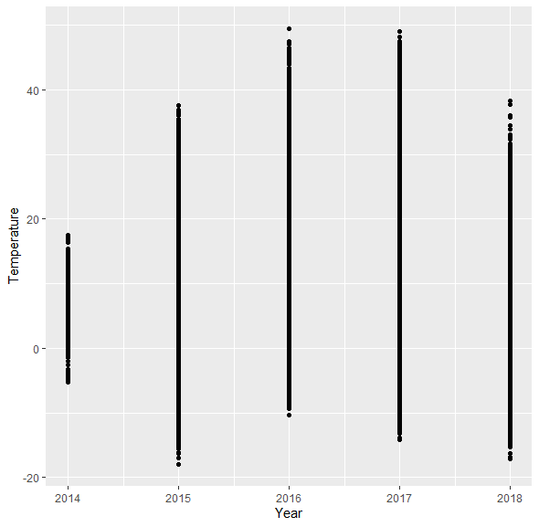
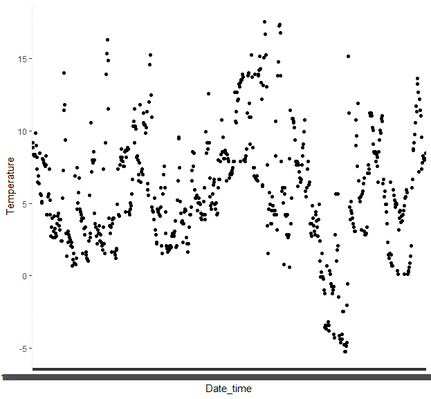
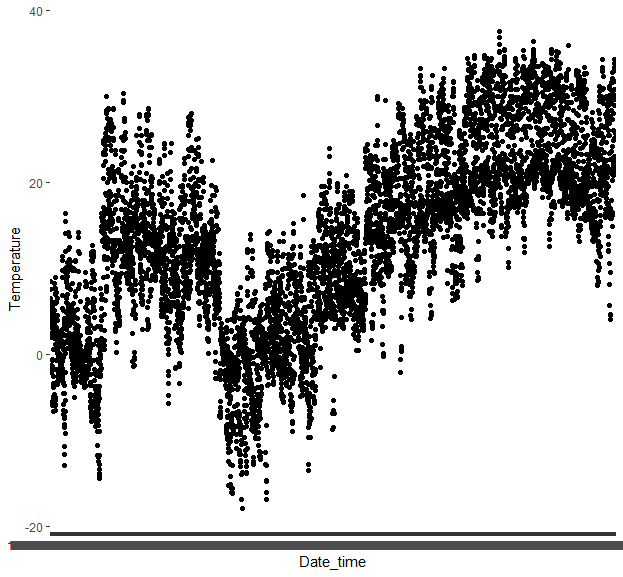
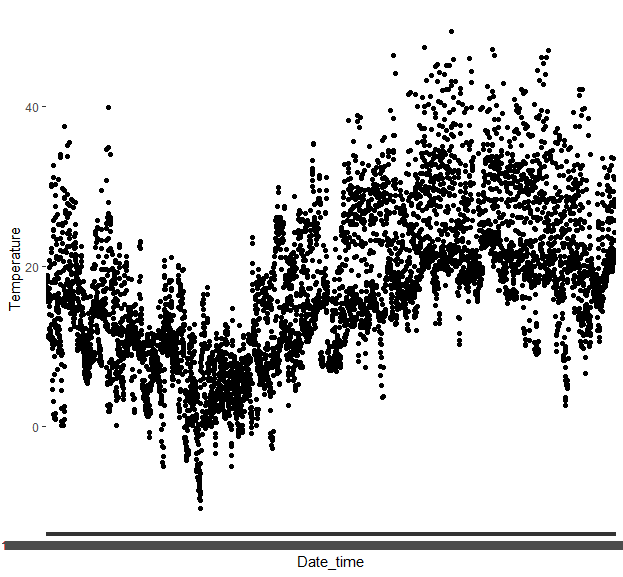
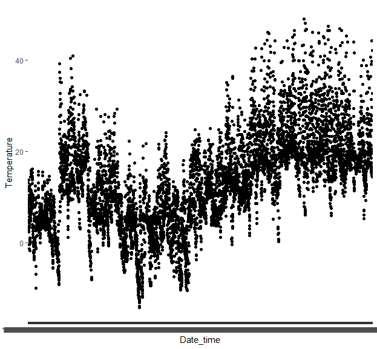
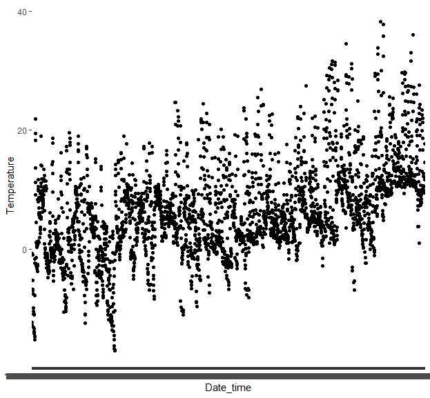
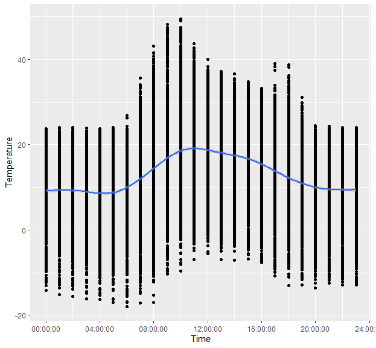
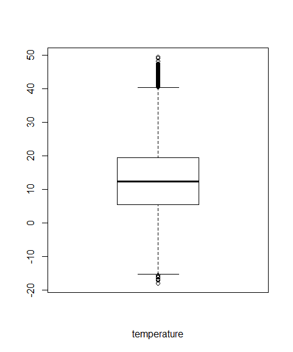
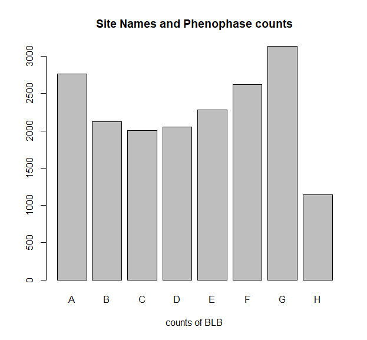

# Linda Loring Nature Foundation - Data Exploration
## About the Datasets
* Temperature Datasets: The temperature datasets that I initially obtained were separated by month and there were some missing values in the datasets. 
 The format of the datasets is quite clean and not a lot of data cleaning work will be needed. I also focused on combining the datasets into one sheet
 divided by sites.  
* Intensity Dataset: The intensity dataset is also cleaned but it has some missing values. The table comes with a clear explanation of each attribute as well as the observations.  
## Data Visualization
### An Overview of Temperature Change in Site A: 

* Codes:
>setwd("C:\\Users\\JosephineQiu\\Desktop\\LindaLoringNatureFoundation")
library(tidyverse)
library(ggplot2)
library(ggfortify)
library(caret)
temp_data <- read_csv("SiteA-Temperature.csv")
ggplot(temp_data, mapping=aes(Year,Temperature),na.rm=TRUE)+geom_point() ]

* Insights:
This scatterplot is the temperature changes within each year. It shows the ranges of the temperature are getting larger if we look at the datasets from 2015 to 2017. The dataset of 2018 has observations to only May while the other datasets contain the observations for the whole year. We will have a better overview once we have the complete dataset for the temperature of 2018.

### Scatter Plots for Temperature of Each Year:
* 2014: 

* 2015: 

* 2016: 

* 2017: 

* 2018: 

* Codes:
>temp_2014 <- temp_data[ which(temp_data$Year=='2014'),]
temp_2015 <- temp_data[which(temp_data$Year=='2015'),]
temp_2016 <- temp_data[which(temp_data$Year=='2016'),]
temp_2017 <- temp_data[which(temp_data$Year=='2017'),]
temp_2018 <- temp_data[which(temp_data$Year=='2018'),]
ggplot(temp_2014,mapping=aes(Date_time,Temperature),na.rm=TRUE) + geom_point()
ggplot(temp_2015,mapping=aes(Date_time,Temperature),na.rm=TRUE) + geom_point()
ggplot(temp_2016,mapping=aes(Date_time,Temperature),na.rm=TRUE) + geom_point()
ggplot(temp_2017,mapping=aes(Date_time,Temperature),na.rm=TRUE) + geom_point()
ggplot(temp_2018,mapping=aes(Date_time,Temperature),na.rm=TRUE) + geom_point()
         
* Insights:  
 Although the temperature dataset for 2018 is incomplete, we can tell from the datasets for the previous years that the average temperature shows the trend to slightly increase every year.

### Temperature Changes vs Time of the Day

* Codes:
>ggplot(temp_data,mapping=aes(Time,Temperature),na.rm=TRUE) + geom_point()+geom_smooth()

* Insights:
From the trendline we can make the assumption that temperature is functionally dependent on the time of the day. We may consider establishing some functions to dig further into our assumption.

### The Boxplot for Temperature

* Codes:
>boxplot(temp_data$Temperature,xlab="temperature")

* Insights:
In the boxplot we can observe some data outside of the first and second quartile range. It is possible that some of them may be outliers or are even high leverage points. We might consider using some 
techniques to help us identify whether those points are due to occasional extreme weather situations or happen regular. Once we figure this out, we may have a better insight on how temperature influences
the plants on breaking leaf buds. 

### Phenophase Counts for Each Site

* Codes:
>library(dplyr)
count <- intensity %>% count(Phenophase_Name=='Breaking leaf buds',Site_Name)
count_by_site <- count[which (count$`Phenophase_Name == "Breaking leaf buds"` == "TRUE"),]
barplot(count_by_site$n,main="Site Names and Phenophase counts",xlab="counts of BLB",
        names.arg = c('A','B','C','D','E','F','G','H') )

* Insights:
This bar plot shows the number of breaking leaf buds grouping by site names. It gives us an overview of how many breaking leave buds happen specifically each site and maybe we would be able to find out the factors that cause the differences in the counts.

## _Proofreader Signoff_
The above contents have been reviewed and confirmed by _Menglin Qiu_.
